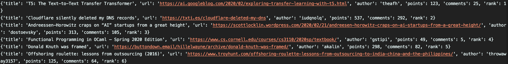

# Hacker News Scraper
This is a short command line application written in python that gets the latest posts from hacker news.
## Table of contents
* [General info](#general-info)
* [Screenshots](#screenshots)
* [Technologies](#technologies)
* [Setup](#setup)
* [Features](#features)
* [Status](#status)
* [Contact](#contact)
## General info
If you love to stay up to date with what is hot in technology, read Hacker News every day.
In order to make it more fun to read for robots (and me), I wrote a simple command line application that would output to STDOUT the top posts in JSON.

If the post has any missing requried field, then that post is discarded from result. I could have just have print out the post with empty values but I think it would be better to just disregard them since it would makes things a little less complicated if a bot was to come across the result from my application. This is purely my design decision for this project.

*Output format*

[{title": "Web Scraping in 2016",
uri": "https://franciskim.co/2016/08/24/dont-need-no-stinking-api-web-scraping-2016-beyond/",
author": "franciskim",
"points": 133,
"comments": 80,
"rank": 1},

{"title": "Instapaper is joining Pinterest",
"uri": "http://blog.instapaper.com/post/149374303661",
"author": "ropiku",
"points": 182,
"comments": 99,
"rank": 2}]

## Screenshots

## Technologies
Python - version 3.8
- requests: library to implement get requests
- urlParse: library to check if valid URL
- argparse: library for passing in command line arguments
## Setup
Open up terminal and navigate to your home directory
- Install python 3.7
- Install the required libraries
- `pip3 install requests`
- `pip3 install urlParse`
- `pip3 install argparse`
## Code Examples
In order to run the code
- Navigate to the src folder of this project
- type in this command `python3 hackernews.py --posts 101`
You can either use --posts or -p after hackernews.py followed by a number of posts you want to return.
You can only requests posts from 0 - 100
## Features
List of features ready and TODOs for future development
- Checks and corrects values of post fields (ex. number being passed as a list)
- Can print out 100 top posts
To-do list:
Add more tests for more robust checking.
Add a loading status bar when posts are being retrieved.
## Status
Project is: _finished_
This is was a short project that I wrote for a take home task for a developer position.
## Contact
Created by [@TS](https://www.linkedin.com/in/talha-sheikh-007/) - feel free to contact me!
